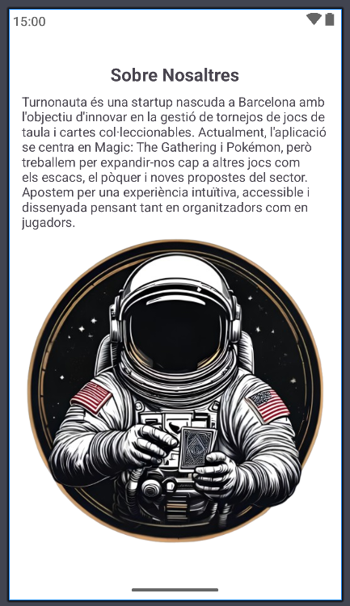
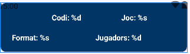

# Turnonauta
Turnonauta és una aplicació per gestionar tornejos de TCG (Trading Card Games) com Magic: The Gathering i Pokémon TCG.

## Links

- [API](https://github.com/Snr1s3/TurnoNauta_FastAPI.git)
- [Server APP](https://github.com/Snr1s3/serverApp_Turnonauta.git)
- [WEB](https://github.com/EdwindanielTIC/web_TurnoNauta.git)  
- [Presentacio](https://docs.google.com/presentation/d/1K03l9CcSwC65fDLJo3RcBxfwdepAkTG-f7iyhe_hQaQ/edit?usp=sharing)
- [Memoria](https://docs.google.com/document/d/1RH_1SOikwa-qEJ7z6mxCnpTQ9W4fVT4ch-nEfXnbZEM/edit?usp=sharing)

## Estructura de directoris del Projecte( SRC i res)                
                      
                        
        
      
## Fitxers .kt del projecte

- **PantallaLogin.kt**  
  Pantalla d'inici de sessió de l'usuari.

### adapters/
Adaptadors per a RecyclerView i llistats:
- `AdapterDetallTorneig.kt`: Mostra detalls d'un torneig.
- `AdapterTornejosJugats.kt`: Mostra tornejos jugats per l'usuari.
- `AdapterUsuarTorneig.kt`: Mostra usuaris d'un torneig.

### aplicacio/
Pantalles principals de l'app:
- `DetallTorneig.kt`: Detall d'un torneig.
- `EscriureCodi.kt`: Entrada de codi per unir-se a un torneig.
- `FiltresTornejos.kt`: Filtratge de tornejos.
- `LlistaTornejosJugats.kt`: Historial de tornejos jugats.
- `OponentActual.kt`: Gestió de la ronda i oponent actual.
- `PaginaPrincipal.kt`: Pantalla principal de l'usuari.
- `PreviewTorneig.kt`: Vista prèvia d'un torneig.

### app/
- `AppTurnonauta.kt`: Classe Application per gestionar estat global (usuari, torneig, etc.).

### config/
Pantalles de configuració i informació legal:
- `AboutUs.kt`: Informació sobre l'app.
- `Configuracio.kt`: Configuració general (idioma, mode nit, notificacions...).
- `EditarPerfil.kt`: Edició del perfil d'usuari.
- `EditName_Fragment.kt`: Fragment per canviar el nom d'usuari.
- `PoliticasPrivacidad.kt`: Polítiques de privacitat.
- `TermsOfUse.kt`: Termes d'ús.

### fragments/
- `BottomMenu.kt`: Fragment pel menú inferior de navegació.

### models/
Models de dades:
- `Models.kt`: Models principals (Usuari, Torneig, Ronda, etc.).
- `ModelsAdapter.kt`: Models específics per a adaptadors.

### recuperar_contrasenya/
Pantalles i lògica per recuperar o canviar la contrasenya.

### registre/
Pantalles i lògica pel registre d'usuaris:
- `Registre.kt`: Registre de nous usuaris.

### retrofit/
Connexió amb l'API backend:
- `ConnexioAPI.kt`: Definició de serveis i implementació de Retrofit.

### screen/
Components d'interfície reutilitzables:
- `MenuInferiorAndroid.kt`: Gestió del menú inferior i navegació.

### socket/
Gestió de connexions en temps real via sockets.

## Estructura del directori `res/`

### drawable/
  Conté recursos gràfics i fitxers XML de formes, icones, i imatges utilitzades a l'app (ex: `logo2.png`, `ajustesapp.png`, `rounded_textview.xml`).

### font/  
  Tipografies personalitzades utilitzades a l'app.

### layout/
  Fitxers XML que defineixen la disposició de les pantalles i fragments de l'app (ex: `activity_pagina_principal.xml`, `activity_registre.xml`, `edit_name_fragment.xml`).

#### Layouts de la app

- **activity_aboutus.xml**  
  Disseny de la pantalla "Sobre Nosaltres".     
    

- **activity_config.xml**  
  Pantalla de configuració de l'usuari (accés a editar perfil, idioma, termes d'ús, política de privacitat, etc.).         
   

- **activity_contrasenya_actualitzada.xml**  
  Mostra el missatge de contrasenya actualitzada correctament.       
   

- **activity_detall_torneig.xml**  
  Disseny per mostrar el detall d'un torneig i el rànquing de jugadors.       
   

- **activity_editar_perfil.xml**  
  Permet a l'usuari editar el seu perfil, incloent la foto i el nom d'usuari.        
  

- **activity_escriure_codi_mail.xml**  
  Pantalla per introduir el codi rebut per correu electrònic durant la recuperació de contrasenya.        
  

- **activity_escriure_codi.xml**  
  Pantalla per introduir el codi d'accés a un torneig.            
  

- **activity_filtres_tornejos.xml**  
  Permet filtrar tornejos per joc, format i nombre de jugadors.                
  

- **activity_llista_tornejos_jugats.xml**  
  Mostra la llista de tornejos jugats per l'usuari.            
  

- **activity_nova_contrasenya.xml**  
  Pantalla per establir una nova contrasenya.            
  

- **activity_oponent_actual.xml**  
  Mostra informació sobre l'oponent actual en un torneig.                
  

- **activity_pagina_principal.xml**  
  Pantalla principal després d'iniciar sessió, amb estadístiques i accés a altres funcionalitats.        
  

- **activity_politicas_de_privacidad.xml**  
  Mostra la política de privacitat.                
  

- **activity_preview_torneig.xml**  
  Previsualització d'un torneig abans d'entrar-hi.                    
  

- **activity_recuperar_contrasenya.xml**      
  Pantalla per iniciar el procés de recuperació de contrasenya.                
  

- **activity_registre.xml**  
  Formulari de registre d'usuari.                
  

- **pantalla_login.xml**  
  Pantalla de Login de l'app.                
  

- **activity_terms_of_us.xml**  
  Mostra els termes d'ús de l'aplicació.                
  

- **edit_name_fragment.xml**  
  Fragment per editar el nom d'usuari.                    
    

- **tornejos_jugats_recycled_view.xml**  
  Disseny d'ítem per la llista de tornejos jugats (RecyclerView).                                            
  

- **detall_torneig_recycled_view.xml**  
  Ítem de la llista de classificació d'un torneig.                                
  

- **usuari_recycled_view.xml**  
  Ítem de llista per mostrar informació d'un usuari.                            
  

### mipmap/  
  Diferents carpetes per a icones de l'app en diverses resolucions de pantalla (`mdpi`, `hdpi`, `xhdpi`, `xxhdpi`, `xxxhdpi`, `anydpi-v26`).

### values/ 
  Fitxers XML amb recursos de text, colors, estils i altres valors reutilitzables. Inclou `strings.xml` (textos en català), `colors.xml`, `styles.xml`, etc.

### values-es-rES/ 
  Traduccions i recursos específics per a l'idioma espanyol (Espanya).

### values-en-rGB/ 
  Traduccions i recursos específics per a l'idioma anglès (Regne Unit).

### values-night/
  Recursos per al mode fosc (dark mode).
